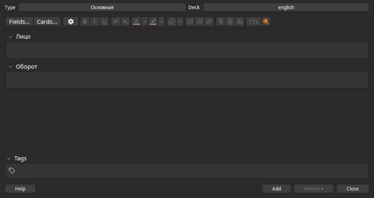

# Anki KokoroTTS Extension

This is an **Anki** extension that integrates [Kokoro-FastAPI](https://github.com/remsky/Kokoro-FastAPI) to generate TTS (text-to-speech) audio from selected text in the card editor. KokoroTTS is an LLM that runs on your local hardware, meaning it's free and you don't depend on external APIs.

## Features

- Adds a TTS button to the Anki card editor.
- Generates audio using [Kokoro-FastAPI](https://github.com/remsky/Kokoro-FastAPI) and inserts it as a `[sound:...]` tag in the current field.
- Supports automatic [Kokoro-FastAPI](https://github.com/remsky/Kokoro-FastAPI) server startup and shutdown (UNIX only, optional).
- Configurable voice, API endpoint, audio format, and more.

## Requirements

- Anki (recent versions)
- UNIX-based OS (for autostart/shutdown features)
- [Kokoro-FastAPI](https://github.com/remsky/Kokoro-FastAPI) running locally or remotely

## Installation

1. Install [Kokoro-FastAPI](https://github.com/remsky/Kokoro-FastAPI)
2. Download or clone this repository.
3. Move, copy, or symlink the entire folder to your Anki add-ons directory.
   - To find your add-ons directory, in Anki go to: `Tools` → `Add-ons` → `Open Add-ons Folder`.
4. Restart Anki.
5. Configure extension `Tools` → `Add-ons` → `config`.
   - `"path_to_kokoro_executable"` is required to configure.

## Configuration

- `voice`: TTS voice name from KokoroTTS.
- `api_url`: URL of the KokoroTTS API server.
- `autostart`: `"true"` to auto-start KokoroTTS server if not running.
- `path_to_kokoro_executable`: Absolute path to the KokoroTTS startup script (e.g. `~/kokoro/start-gpu.sh`).
- `audio_format`: Output audio file format (e.g., `"mp3"`).
- `shutdown_by_timer`: `"true"` to auto-shutdown KokoroTTS server after inactivity.
- `idle_timeout_in_seconds`: Seconds before Kokoro shuts down.

## Usage

- Open the Anki card editor.
- Select text in a field and click the **TTS** button.
- Audio will be generated and inserted as a `[sound:...]` tag.

## Notes

- Because the TTS button essentially launches another, "heavy" project, the first press may take some time—for me, it's around 7 seconds. However, since everything runs in parallel, you can continue filling out the card while Kokoro is loading.
- Autostart and shutdown features require UNIX OS.
- KokoroTTS server must be accessible at the configured `api_url`.
- The extension will attempt to start the server if `autostart` is enabled.

## License

MIT License

## Author

[Miron Sadykov](https://github.com/Reagent992)
